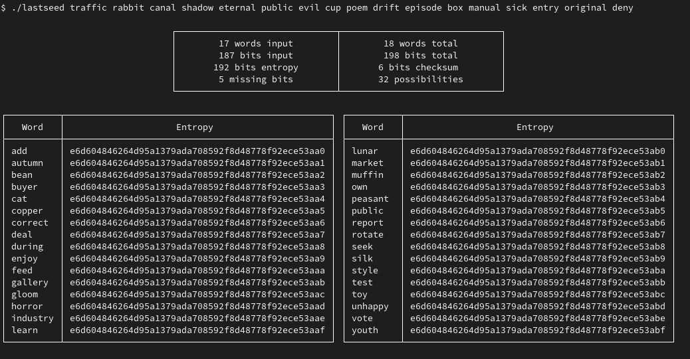

# lastseed

Display the possible last seed words from 11, 14, 17, 20 or 23 words.  
Entropy is also displayed and can be pasted into [Ian Coleman bip39](https://github.com/iancoleman/bip39) or similar tools.

## Usage

```bash
./lastseed traffic rabbit canal shadow eternal public evil cup poem drift episode box manual sick entry original deny
```

or

```bash
./lastseed
Enter seed words:
traffic rabbit canal shadow eternal public evil cup poem drift episode box manual sick entry original deny
```



## Build

```bash
go build -o lastseed ./src  
```
